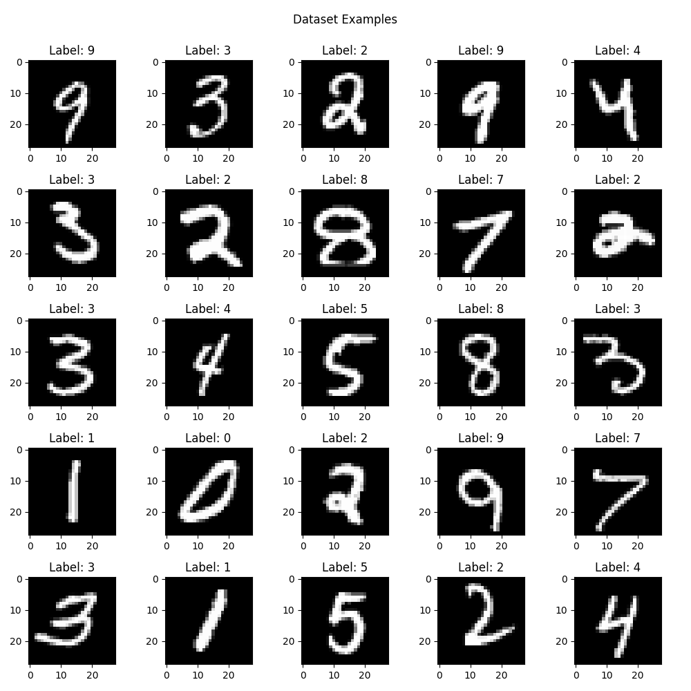
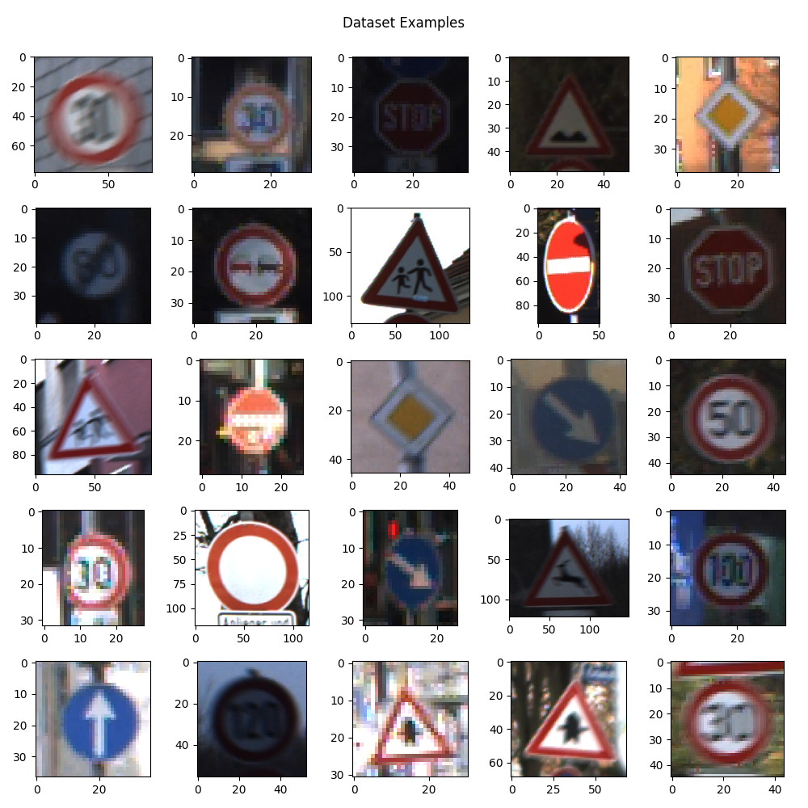

# Tensorflow for Computer Vision Course - Full Python Tutorial for Beginners

## REFERENCE COURSE: [YouTube](https://www.youtube.com/watch?v=cPmjQ9V6Hbk)

## Requirements

- numpy = 1.19.5

- matplotlib = 3.4.3

- tensorflow = 2.6.0

## First Part

### MNIST Example

The MNIST database of handwritten digits has a training set of 60,000 examples, and a test set of 10,000 examples. It is a subset of a larger set available from NIST. The digits have been size-normalized and centered in a fixed-size image [[1]](#references).

It is a good database for people who want to try learning techniques and pattern recognition methods on real-world data while spending minimal efforts on preprocessing and formatting [[1]](#references).

### Data Preview

Some examples from the dataset:

### Steps

- How to load it from Tensorflow datasets.
- How to explore a dataset.
- Tensorflow layers.
- Building a neural network the sequential way.
- Building a neural network the functional way.
- Building a neural network the model class way.
- Compiling the model and fitting the data.
- Restructured our code for better readability.

## Second Part

### Traffic Sign Example

The German Traffic Sign Benchmark is a multi-class, single-image classification challenge held at the International Joint Conference on Neural Networks (IJCNN) 2011. The benchmark has the following properties [[2]](#references):

- Single-image, multi-class classification problem
- More than 40 classes
- More than 50,000 images in total
- Large, lifelike database

### Data Preview

Some examples from the dataset:

### Steps

- Explored the dataset.
- Prepared train, validation and test sets.
- Built a neural network the functional way.
- Created data generators.
- Added callbacks.
- Trained and evaluated the model.
- Discussed potential improvements.
- How to run inference on single images.

## References

[1. THE MNIST DATABASE of handwritten digits](http://yann.lecun.com/exdb/mnist/)

[2. GTSRB - German Traffic Sign Recognition Benchmark](https://www.kaggle.com/meowmeowmeowmeowmeow/gtsrb-german-traffic-sign)

